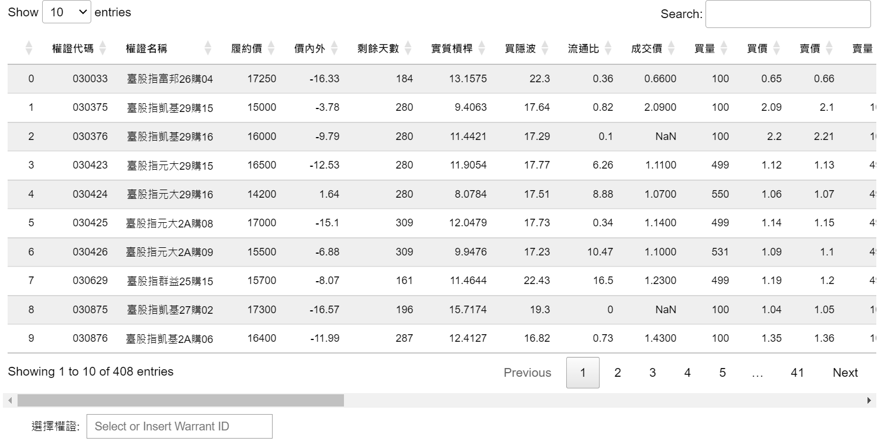

# 權證搜尋幫手

## 主程式

* Warrant_Search.ipynb

## 主程式中函式引用

* warrant_search.py

## 標的清單來源

* 上市上櫃權證標的_crawler.ipynb (透過此檔取得上市上櫃有發行權證標的清單(csv))

## 使用說明
**`此工具在盤中也可執行`**
1. Warrant_Search.ipynb 中有4個 cell，打開此ipynb檔後可直接執行第一個cell，可得到下列結果

 

2. 點擊想要搜尋的權證類型，在標的股票文字框中輸入目標標的(可透過清單搜尋或直接輸入，若選擇文字輸入，**`請務必點擊標的選項`**)，並設定篩選條件(輸出結果已帶入預設參數)

 

3. 輸入完成後點擊第二個cell，此cell並不會有輸出值，但已經抓回未套用篩選條件，所選擇標的之完整權證資料

 

4. 接著可以直接點擊第三個cell，此cell之輸出值為套用篩選條件，所選擇標的之完整權證資料
    * **`此時可隨時再更改第一個cell中的篩選條件，不需要再重新執行前兩個cell，直接重新執行此cell即可得到套用新篩選條件的結果`**
    * **`但若是更改權證類型與選擇標的，必須再重新執行第兩個cell，重新取得新選擇標的之完整權證資料`**

 

5. 找到喜歡的權證後，在選擇權證的文字框中輸入想查閱五檔資料與歷史買隱含波動率的權證

 

6. 執行第四個cell，即可得到下列結果，包含執行當下的標的(收盤)價格、標的漲跌幅、所選權證的資訊、五檔價量，以及歷史買隱含波動率的數據
    * **`如果要查看其他權證資訊，不需要再重新執行第三個cell，只要更改選擇權證文字框中的數據，直接重新執行此cell即可得到新資訊`**

 

7. 因上傳 ipynb 檔後，上傳前的輸出結果無法顯示，在此 repo 中有`result1.png ~ result4.png`，為執行結果之截圖可供參考
